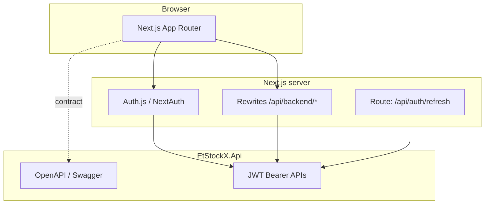

# EtStockX Frontend Architecture

This document describes how the EtStockX web client is structured, how it talks to the EtStockX API, and where to extend the codebase. It complements the product requirements (SRS) and the backend’s OpenAPI specification.

## Goals

- **Institutional UX:** Clear, accessible flows for registration, verification, profiles, and admin workflows aligned with a regulated brokerage context.
- **Maintainability:** Feature-oriented modules with shared UI, API, and config kept in predictable locations (Feature-Sliced Design inspired layout).
- **Type safety:** TypeScript throughout; API shapes documented in code and optionally generated from Swagger.
- **Operational clarity:** Same-origin API access in development via rewrites, optional CORS on the API, and explicit environment configuration.

## System context



- **Browser:** React 19, client-side data fetching via Axios + TanStack Query; session via Auth.js client helpers.
- **Next.js:** Server-side login and token refresh call the API using `API_URL` (no CORS required for those server-to-server hops).
- **Public API calls from the browser** default to `NEXT_PUBLIC_API_URL=/api/backend`, which Next rewrites to `{API_URL}/api/*`.

## Technology stack

| Area             | Choice                               | Role                                        |
| ---------------- | ------------------------------------ | ------------------------------------------- |
| Framework        | Next.js 15 (App Router)              | Routing, RSC, SSR, middleware               |
| Language         | TypeScript 5                         | End-to-end typing                           |
| Styling          | Tailwind CSS 4, shadcn/ui (Base UI)  | Design tokens and components                |
| Server state     | TanStack Query                       | Caching, mutations, query keys per feature  |
| Client global UI | Redux Toolkit                        | Lightweight UI state (e.g. layout toggles)  |
| Auth             | Auth.js v5 (NextAuth) + Credentials  | JWT access/refresh from EtStockX IAM        |
| i18n             | next-intl                            | English and Amharic, locale-prefixed routes |
| HTTP client      | Axios                                | Interceptors, 401 refresh coordination      |
| Forms            | React Hook Form + Zod (available)    | Complex forms as features grow              |
| Testing          | Jest + RTL, Playwright               | Unit and smoke E2E                          |
| Quality          | ESLint, Prettier, Husky, lint-staged | Lint/format on commit                       |

## Source layout

The codebase follows an FSD-style split under `src/`:

```
src/
├── app/                    # Next.js App Router
│   ├── [locale]/           # Localized segments: /en/..., /am/...
│   │   ├── (auth)/         # Route group: login, register, verify-email
│   │   ├── (dashboard)/    # Protected: dashboard, profile/*, admin/*
│   │   └── (market)/       # Public market placeholder
│   ├── api/auth/           # Auth.js handlers + refresh helper route
│   └── layout.tsx          # Root passthrough (html in [locale]/layout)
├── features/               # Vertical slices
│   ├── auth/
│   ├── profiles/
│   ├── admin/
│   ├── trading/            # Shell until Trade API exists
│   ├── listings/
│   ├── portfolio/
│   └── messaging/
├── entities/               # Domain-oriented types (thin, re-export API DTOs where useful)
├── shared/
│   ├── api/                # Axios instance, interceptors, types, generated OpenAPI
│   ├── config/             # Environment helpers
│   ├── i18n/               # Locales, routing, request config
│   ├── lib/                # Utilities (cn, API error parsing)
│   ├── providers/          # Session, Redux, Query, API auth bridge
│   ├── store/              # Redux store and slices
│   └── ui/                 # Shared components (shadcn)
├── auth.ts                 # Auth.js configuration (Credentials → IAM login)
├── middleware.ts           # next-intl + Auth.js middleware (locale, roles)
└── types/                  # Global augmentations (e.g. next-auth)
```

Route groups `(auth)`, `(dashboard)`, and `(market)` do not appear in URLs; they organize files only.

## Authentication and session

1. **Login:** The Credentials provider posts to `POST {API_URL}/api/v1/auth/login` and receives access token, refresh token, role, `userId`, and `isActivated`.
2. **Session:** Tokens and claims are stored in the encrypted JWT session (Auth.js). The client receives `accessToken`, `role`, `isActivated`, and `email` via `useSession` where exposed in callbacks.
3. **API calls:** `AppProviders` attach `Authorization: Bearer <accessToken>` to the shared Axios instance and register a **single-flight** refresh on 401 via `POST /api/auth/refresh`, which calls `POST /api/v1/auth/refresh-token` on the server using the refresh token from the session cookie.
4. **Middleware:** `src/middleware.ts` composes `next-intl` with Auth.js. Protected paths under `/[locale]/dashboard`, `/profile`, and `/admin` require a session. Admin and broker profile routes enforce `role` checks.

## Data fetching conventions

- **Query keys:** Colocated per feature (e.g. `features/profiles/api/keys.ts`) to avoid cache collisions.
- **Hooks:** `useQuery` / `useMutation` wrappers live next to the feature they serve.
- **Errors:** Prefer `getApiErrorMessage` from `shared/lib/api-error.ts` for Axios error bodies shaped as `{ error: string }`.

## Internationalization

- Locales: `en`, `am` (prefix always: `/en/...`, `/am/...`).
- Messages live in `shared/i18n/locales/*.json`.
- Navigation helpers (`Link`, `redirect`, `useRouter`, `usePathname`) come from `shared/i18n/routing.ts` so locale stays consistent.

## API contract and code generation

- **Runtime contract:** EtStockX.Api Swagger at `/swagger/v1/swagger.json` when the API is running.
- **Types:** Run `npm run openapi` with the API up to regenerate `src/shared/api/generated/schema.d.ts`. Hand-written DTOs in `shared/api/types.ts` cover critical paths today.

## Security notes

- Do not log or persist refresh tokens in client storage beyond what Auth.js already encodes in its cookie.
- Use HTTPS and strong `AUTH_SECRET` / `NEXTAUTH_SECRET` in production.
- The backend should restrict CORS to known origins in production; the dev policy allows `localhost:3000` for convenience.

## Testing strategy

- **Unit:** Jest + Testing Library setup; example tests on shared utilities (`cn`).
- **E2E:** Playwright smoke tests against `npm run dev` (see `e2e/`).
- **CI:** GitHub Actions runs lint, format check, unit tests, production build, then Playwright.

## Extension guidelines

1. **New API-backed feature:** Add a folder under `features/<name>/` with `api/`, `components/`, and optional `hooks/`.
2. **New route:** Add a page under `app/[locale]/` inside the appropriate route group; update `middleware.ts` if the path needs auth or role rules.
3. **New entity types:** Prefer extending `shared/api/types.ts` or generated OpenAPI types, then thin re-exports under `entities/<name>/model/`.
4. **New strings:** Add keys to both `en` and `am` locale files for user-visible copy.

## Related documentation

- Backend README and modular monolith architecture (sibling `ETStockX-Backend` repository).
- Product SRS (Software Requirements Specification) for functional scope and acceptance themes.
